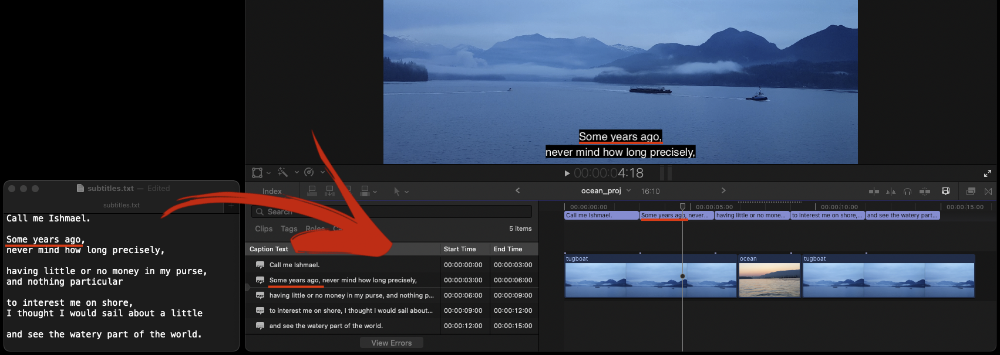
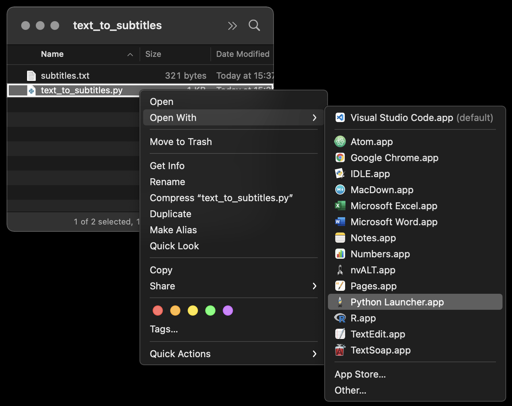

# Text to Subtitles - Python

This is a fork of the original project from [DmytroNorth](https://github.com/DmytroNorth/Text_To_Subtitles-Python).

I tried to make it more pythonic and more easily importable as a module.

This project can be easily implemented into and enhanced by the library [srt](https://github.com/cdown/srt).

---



This python file **creates subtitles of a given length** from **text paragraphs** that can be easily imported into any **Video Editing software** such as FinalCut Pro for further adjustments.

## 1. Table of Contents

- [Text to Subtitles - Python](#text-to-subtitles---python)
  - [1. Table of Contents](#1-table-of-contents)
  - [2. Description](#2-description)
    - [2.1 Problem](#21-problem)
    - [2.2 Solution](#22-solution)
    - [2.3 Motivation behind the project](#23-motivation-behind-the-project)
    - [2.4 Development history](#24-development-history)
  - [3. Technologies Used](#3-technologies-used)
  - [4. Installation](#4-installation)
  - [5. Usage](#5-usage)
    - [5.1 Prepare .txt file](#51-prepare-txt-file)
      - [5.2 Rename and move .txt file](#52-rename-and-move-txt-file)
    - [5.3 Launch Python script](#53-launch-python-script)
    - [5.4 Open subtitles.srt with FinalCut Pro](#54-open-subtitlessrt-with-finalcut-pro)
  - [6. Project Status](#6-project-status)
  - [7. Known Limitations](#7-known-limitations)
  - [8. Room for Improvement](#8-room-for-improvement)
  - [9. License](#9-license)
  - [10. Contact](#10-contact)

<!-- * [License](#license) -->

## 2. Description

### 2.1 Problem

In a fast-paced TV, Film, and Video production environment **Video Editors** are often faced with the task to create subtitles quickly and efficiently. They will often have a script that they manually into Video Editing software, one subtitle at a time, then adjust the timing.

In the case of Documentary films or long interviews, the number of subtitles can be overwhelming. In addition, there can be multiple subtitles in different languages.

### 2.2 Solution

Instead of manually typing the text in Video Editing Software or copy-pasting it from a text file one subtitle at a time this python script automatically converts text paragraphs, located in a text file into a standard .srt subtitle file. It can be then imported into any Video Editing Software.

The script creates subtitles of the same length, such as 3 seconds. Therefore, manual adjustments are still needed after importing the subtitles. Nevertheless, this workflow has proven to be much faster than the full manual process described above.

**Input:**
```
Call me Ishmael.

Some years ago,
never mind how long precisely,

having little or no money in my purse,
and nothing particular

```
**Output:**
```
1
00:00:00,000 --> 0:00:03,000
Call me Ishmael.

2
00:00:03,000 --> 0:00:06,000
Some years ago,
never mind how long precisely,

3
00:00:06,000 --> 0:00:09,000
having little or no money in my purse,
and nothing particular

```
### 2.3 Motivation behind the project

I first created this workflow when I was Directing and Video Editing TV mini-series. Since deadlines were extremely tight I was looking at every opportunity to speed up the delivery times while maintaining high quality. I later used it for commercial Videography projects. This solution fits my workflow very well and has proven to be very useful.

### 2.4 Development history

It was originally built simply by using a stack of **regular expressions** executed in the TextSoap.app along with some operations in Excel and manula copy-pasting. Later most of the steps were combined in a single Python script that is presented here.

## 3. Technologies Used

* **`Python 3.9.4`**, compatible with `Python 2.7` and above
* **`datetime`** integrated module to work with date and time
* **`re`** integrated regular expression operations module
* **`os`** a portable way of using operating system dependent functionality

## 4. Installation

Download **`text_to_video_subtitles.py`** file from this GitHub repository.

## 5. Usage
### 5.1 Prepare .txt file
Take **existing script** or type it from scratch. Then **manually split** it into paragraphs in the following format:
```
Call me Ishmael.

Some years ago,
never mind how long precisely,

having little or no money in my purse,
and nothing particular
```
* A **single line** represents a **single line** in a subtitle.
* **Empty line** defines where one **subtitle ends** and a new one **begins**.
* Normally one subtitle has **one or two lines**, but it can have **more**. 


#### 5.2 Rename and move .txt file

Paste the text into a text editor, then save it as `subtitles.txt`, and move the file into the same folder with `text_to_subtitles.py`.

### 5.3 Launch Python script

Open **Terminal.app**. Type `python`, add `space`, then drag and drop `text_to_video_markers.py` and press `Return`.


Alternatively, you can install the latest version of [Python](https://www.python.org/downloads/macOS). Then right-click on `text_to_video_markers.py` file and choose `Open with -> Python Launcher.app`.



Either method will run the script and create `subtitles.srt` file in the same folder.
### 5.4 Open subtitles.srt with FinalCut Pro

In FinalCut Pro choose `File -> Import -> Captions...`, then navigate to newly created `subtitles.srt` and select `Import`. This will **import subtitles** into an existing project. They will be visible in **Timeline, Index (Captions), and Viewer**. You can now easily adjust individual subtitles in Timeline and edit the text in Timeline and Inspector.

**That's it!** We have just automatically converted text with paragraphs into a universal .srt subtitle file for further adjustments and manipulations in Video editing software such as FinalCut Pro..


## 6. Project Status

The project is: **_complete_**
I am no longer working on it since I am not working for TV any longer. But if you have some ideas or want me to modify something [contact me](#contact) and we should be able to collaborate.

## 7. Known Limitations

* An input text file must be named `subtitles.txt`
* Text in `subtitles.txt`** file must be **split into paragraphs**.
* Both `text_to_subtitles.py` and `subtitles.txt` must be located in the **same folder**.
* The default subtitle length is **3 seconds** and can only be changed inside `text_to_subtitles.py` code by changing the number in `dursec = 3` statement.

## 8. Room for Improvement

* **Testing** and logging the issues.
* Making python script an **executable file**.
* **Developing GUI** to be able to specify .txt and .fcpxml input files with any name and location.
* Building a **web app**.

## 9. License

This project is open-source and available under the [GNU General Public License v3.0](https://choosealicense.com/licenses/gpl-3.0/#)

## 10. Contact

Created by [@DmytroNorth](https://github.com/DmytroNorth) - feel free to contact me at dmytronorth@gmail.com!
